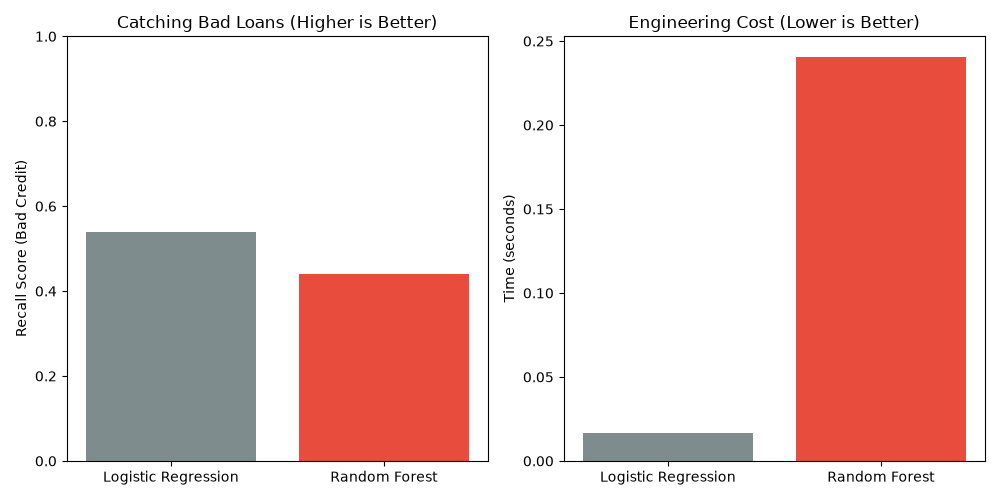
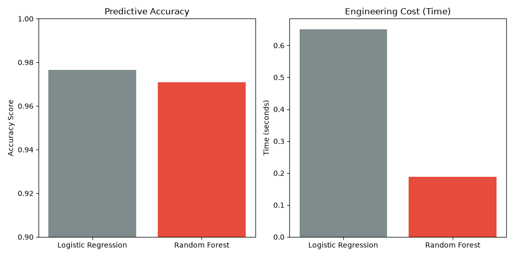
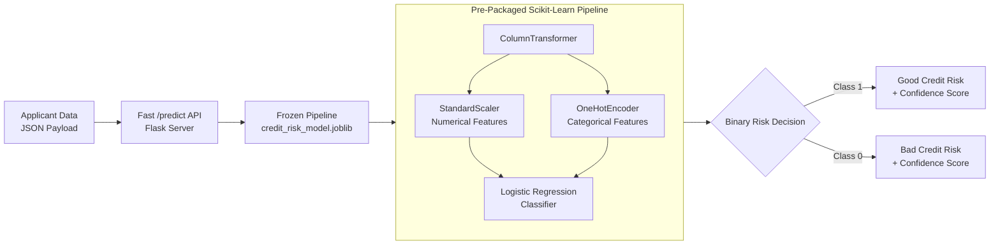

# ML-T2-090: Knowing When a Simple Model Is Better Than a Complex One

[](https://www.python.org/)
[](https://scikit-learn.org/)
[]()
[](LICENSE)
[]()

> **Empirical research evaluating the trade-offs between model complexity, inference latency, business-critical recall, and regulatory explainability in financial machine learning systems.**

---

## 📌 Executive Summary

In modern machine learning practice, teams often jump directly to complex ensemble algorithms (such as Random Forests, Gradient Boosted Trees, or Deep Neural Networks) assuming higher algorithmic complexity translates directly to superior business outcomes.

**ML-T2-090** empirically challenges this assumption within the high-stakes, heavily regulated domain of **Credit Risk Assessment**. Using the benchmark [OpenML German Credit dataset (`credit-g`)](https://www.openml.org/search?type=data&id=31), this study systematically benchmarks a foundational, highly interpretable **Logistic Regression** baseline against an ensemble **Random Forest** classifier.

### Key Finding:
While both models achieve an identical overall accuracy of **79.50%**, the simple Logistic Regression baseline significantly outperforms the complex Random Forest on the metric that directly safeguards financial assets: **Recall for Bad Credit applicants (54.0% vs. 44.0%)**, while executing **14.6x faster** in inference and training, and providing full mathematical transparency required by financial regulatory bodies.

---

## 📊 Empirical Results & Comparison

### Performance & Engineering Trade-off Matrix

| Metric | Simple Baseline (Logistic Regression) | Complex Ensemble (Random Forest) | Winner & Business Impact |
| :--- | :---: | :---: | :--- |
| **Overall Accuracy** | **79.50%** | **79.50%** | **Tie** — Demonstrates how aggregate accuracy obscures model behavioral differences. |
| **Recall (Bad Credit Risk)** ⭐ | **54.00%** | **44.00%** | **Baseline (+10.0%)** — Catches 10% more defaulting loans, protecting bank balance sheets. |
| **Precision (Bad Credit Risk)** | **64.00%** | **68.00%** | **Complex (+4.0%)** — Slight edge, but heavily offset by missed defaults. |
| **Precision (Good Credit Risk)** | **83.00%** | **81.00%** | **Baseline (+2.0%)** — Better fidelity when clearing low-risk applicants. |
| **Execution / Training Latency** | **0.0165 s** | **0.2408 s** | **Baseline (14.6x Faster)** — Minimal compute overhead, instant cold starts, zero heavy memory footprint. |
| **Regulatory Compliance & Explainability** | **Full (Linear coefficients / Odds Ratios)** | **Low (Black-box ensemble of 100 trees)** | **Baseline** — Fully auditable for ECOA, FCRA, and adverse action reporting mandates. |

---

## 📈 Visual Trade-off Analysis

### 1. Credit Risk Trade-Off (Business Recall vs. Engineering Cost)
The chart below highlights the core outcome: the simple baseline captures more bad loans while consuming significantly less engineering time.



### 2. Baseline Validation Benchmark (Breast Cancer Reference)
A preliminary benchmark validating that accuracy parity exists between linear baselines and complex ensembles on structured tabular data, while engineering latency differs by orders of magnitude.



---

## 💡 Why the Simple Model Wins in Credit Risk

### 1. The Class Imbalance & The "Accuracy Trap"
In credit scoring, datasets are naturally imbalanced (here: 70% Good Credit, 30% Bad Credit). The complex Random Forest over-optimized for the majority class ("Good Credit") to maximize overall accuracy, ignoring subtle minority boundary signals. Consequently, it missed **56% of defaulting borrowers**. Logistic Regression maintained balanced sensitivity across both classes.

### 2. The Asymmetric Cost of Financial Errors
In commercial lending, errors are not equal:
$$\text{Cost}(\text{False Positive: Denying Good Borrower}) \ll \text{Cost}(\text{False Negative: Approving Defaulting Borrower})$$
A missed default results in principal charge-offs, whereas a rejected good borrower is merely an opportunity cost. Logistic Regression's **54% recall** drastically lowers credit loss.

### 3. Regulatory Mandates & Legal Explainability
Under regulations such as the **Equal Credit Opportunity Act (ECOA)** and the **Fair Credit Reporting Act (FCRA)**, financial institutions are legally obligated to issue **Adverse Action Notices** detailing the exact financial factors leading to a denial. 
- **Logistic Regression:** Transparent log-odds coefficients directly provide exact feature weights.
- **Random Forest:** Complex non-linear splits across 100 decision trees introduce black-box risk and non-trivial regulatory compliance barriers.

---

## 🛠️ System Architecture & Workflow



---

## 🗂️ Project Structure

```text
ML-T2-090-Model-Complexity/
├── docs/
│   ├── baseline_tradeoff.png               # Benchmark visualization (LR vs RF on Tabular)
│   ├── credit_model_tradeoff.png           # Credit risk visualization (Recall vs Compute Time)
│   ├── credit_risk_model.joblib            # Frozen production Scikit-Learn Pipeline artifact
│   ├── ML-T2-090_Project_Documentation.pdf # Complete project research documentation (PDF)
│   ├── ML_T2_090_Final_Paper.docx          # Academic research paper submission (DOCX)
│   └── Stage1_Research_Brief.docx          # Stage 1 project brief and formulation (DOCX)
├── src/
│   ├── app.py                              # Production Flask REST API (/predict endpoint)
│   ├── test_api.py                         # Automated client script testing API with real samples
│   ├── baseline_comparison.py              # Initial benchmark script comparing LR and RF
│   ├── credit_model_showdown.py            # Head-to-head model showdown on OpenML German Credit data
│   ├── credit_visuals.py                   # Plotting script generating credit_model_tradeoff.png
│   ├── data_inspection.py                  # Exploratory script analyzing class balance & shapes
│   ├── data_preprocessing.py               # ColumnTransformer pipeline verification script
│   ├── export_model.py                     # Serializes full preprocessor + winning model to joblib
│   ├── generate_final_paper.py             # Generates ML_T2_090_Final_Paper.docx
│   ├── generate_stage1_brief.py            # Generates Stage1_Research_Brief.docx
│   └── generate_readme.py                  # Standalone README generator utility
├── requirements.txt                        # Strict locked dependency manifest
└── README.md                               # Project documentation & GitHub overview
```

---

## 🚀 Getting Started

### 1. Prerequisites
- Python 3.10+ recommended
- Virtual environment tool (`venv` or `conda`)

### 2. Installation
Clone the repository and install the dependencies:
```bash
git clone https://github.com/grvd5678/ML-T2-090-Model-Complexity.git
cd ML-T2-090-Model-Complexity

# Create and activate virtual environment
python -m venv venv
# On Windows:
.\venv\Scripts\activate
# On Linux/macOS:
source venv/bin/activate

# Install locked dependencies
pip install -r requirements.txt
```

### 3. Run Experiments & Model Showdown
To reproduce the empirical evaluation between Logistic Regression and Random Forest:
```bash
python src/credit_model_showdown.py
```

To re-run the baseline benchmark:
```bash
python src/baseline_comparison.py
```

### 4. Re-generate Visualizations
```bash
python src/credit_visuals.py
```

---

## 🌐 Local API & Inference

The project exports a fully bundled Scikit-Learn `Pipeline` (preprocessing + winning model) into `docs/credit_risk_model.joblib` and serves it via a lightweight Flask service.

### Step 1: Start the Prediction Server
```bash
python src/app.py
```
*Server starts on `http://127.0.0.1:5000`.*

### Step 2: Query the API (In a separate terminal)
```bash
python src/test_api.py
```

### Example Request (`POST /predict`):
```bash
curl -X POST http://127.0.0.1:5000/predict \
     -H "Content-Type: application/json" \
     -d '{
       "checking_status": "<0",
       "duration": 6.0,
       "credit_history": "critical/other existing credit",
       "purpose": "radio/tv",
       "credit_amount": 1169.0,
       "savings_status": "no known savings",
       "employment": ">=7",
       "installment_commitment": 4.0,
       "personal_status": "male single",
       "other_parties": "none",
       "residence_since": 4.0,
       "property_magnitude": "real estate",
       "age": 67.0,
       "other_payment_plans": "none",
       "housing": "own",
       "existing_credits": 2.0,
       "job": "skilled",
       "num_dependents": 1.0,
       "own_telephone": "yes",
       "foreign_worker": "yes"
     }'
```

### Example Response:
```json
{
  "status": "success",
  "prediction": "Good Credit Risk",
  "confidence_score": 0.8924
}
```

---

## ☁️ Cloud Deployment Readiness

The serialized artifact (`docs/credit_risk_model.joblib`) encapsulates all feature engineering, scaling, and classification steps into a self-contained pipeline. It is architected for zero-state serverless deployments:
- **AWS Lambda + API Gateway:** Drop the pipeline into a Lambda container image or layer for sub-20ms cold-start serverless inference.
- **Docker / Kubernetes:** Easily packaged with `gunicorn` / `uvicorn` for horizontally scalable microservice architectures.

---

## 📚 Deliverables & Documentation

Complete academic and project reports are available in the [`docs/`](docs/) directory:
- 📄 **[Final Research Paper (`ML_T2_090_Final_Paper.docx`)](docs/ML_T2_090_Final_Paper.docx):** Complete academic treatise examining model complexity vs. business performance.
- 📋 **[Project Documentation PDF (`ML-T2-090_Project_Documentation.pdf`)](docs/ML-T2-090_Project_Documentation.pdf):** Consolidated project documentation.
- 📝 **[Stage 1 Research Brief (`Stage1_Research_Brief.docx`)](docs/Stage1_Research_Brief.docx):** Initial formulation, hypothesis, and evaluation strategy.

---

## 👤 Author & Attribution
- **Project ID:** ML-T2-090
- **Author:** Gourav Das ([@grvd5678](https://github.com/grvd5678))
- **Track:** Model Complexity & Trade-Off Analysis in Machine Learning
